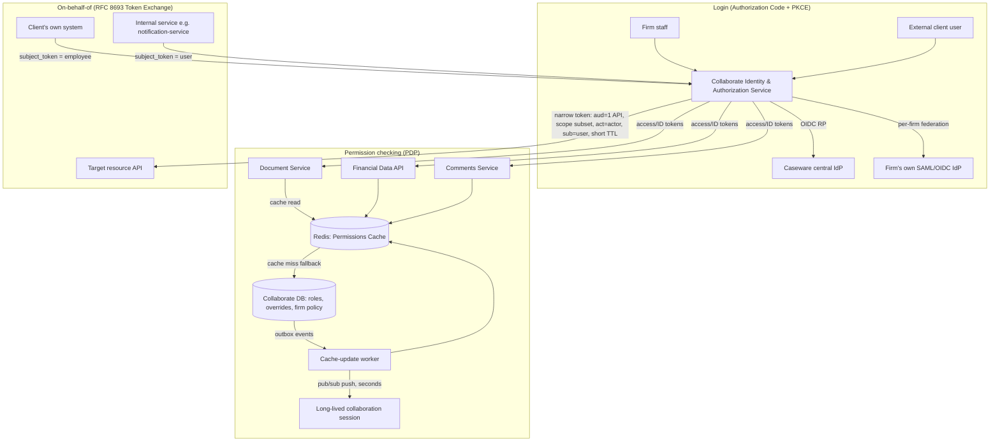
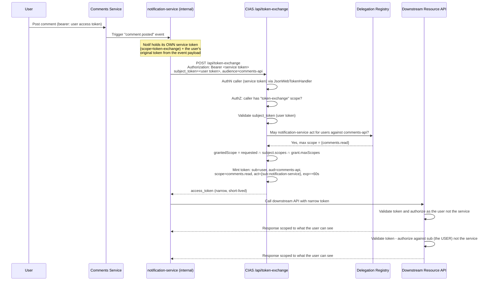

# Collaborate Identity & Authorization Layer — Design Document

**Author:** Carlos Bastos · **Role:** Senior Developer, Collaborate · **Date:** 2026-08-17

*Diagrams referenced below are also included standalone as `docs/architecture.mmd` and `docs/token-exchange-sequence.mmd`.*

## 1. High-Level Architecture

I'm proposing a dedicated **Collaborate Identity & Authorization Service (CIAS)** — a standards-compliant OAuth2/OIDC Authorization Server that sits in front of the three resource APIs (Document Service, Financial Data API, Comments Service). CIAS is *not* a replacement for Caseware's central identity provider; it's the Collaborate-scoped layer that turns "who is this person/system" into "what can they do in this workspace, right now," and issues the tokens those APIs already expect.

**Why a separate authorization server instead of pointing resource APIs straight at Caseware's IdP:** the central IdP only knows about firm staff and only speaks one protocol upstream. Collaborate needs per-firm federated logins, fine-grained resource-level permissions, and on-behalf-of delegation — none of which belong in a shared, firm-wide identity provider. CIAS is built on ASP.NET Core with **Duende IdentityServer** (or an equivalent OSS/managed OIDC server) as the token-issuance engine, so discovery, PKCE, JWKS rotation, and token endpoint semantics are handled by a maintained, spec-compliant library rather than hand-rolled.

**Two login populations, one flow.** Both firm staff and external client users authenticate via Authorization Code + PKCE against CIAS. CIAS itself acts as the *client* to whichever upstream identity source applies:
- Firm staff → Caseware's central OIDC IdP (CIAS is a standard OIDC Relying Party here).
- External users → either Caseware-hosted credentials (invite/passwordless) or the firm's own federated SAML/OIDC IdP, selected via a per-firm `IdentityProvider` record (protocol, metadata URL, signing certs, claim mapping) resolved by firm-scoped login URL or email-domain-based home-realm discovery.

CIAS normalizes whatever comes back (SAML assertion or OIDC claims) into a consistent internal claim set (`sub`, `firm_id`, `user_type`, `upstream_idp`) before minting its own Collaborate access/ID tokens. This means Document/Financial/Comments services only ever need to understand one token shape, regardless of how the user actually logged in.

**Permission checking (the PDP).** Workspace role, resource-level overrides, and firm policy remain in Collaborate's own DB as the source of truth — I'm not moving them. What changes is how they're *read* at request time. Access tokens are short-lived (~5 min) and carry only coarse, cheap-to-verify claims (firm, user type, workspace membership at issuance). They deliberately do **not** embed fine-grained resource permissions, because those change too often and the token would go stale immediately. Instead, each resource API's authorization check runs as a two-step: (1) verify the JWT locally via standard `JwtBearer` middleware — no round trip; (2) consult a **Permissions Cache** (Redis) via a shared `AuthorizationClient` library, structured as `[Authorize(Policy = "workspace:owner-or-override")]` using a custom `IAuthorizationHandler`. The cache is a denormalized per-(user, workspace, resource) projection kept warm by an event pipeline: every role/override/policy write in the DB emits an outbox event, which a worker publishes to Redis and updates the cache directly. Cache reads are sub-millisecond and stay off the DB entirely in the common case; a cache miss falls back to a direct DB read (and repopulates the cache), which is the safety net, not the steady-state path.

**Revocation on long-lived sessions.** Short token TTL alone isn't enough for an open collaborative-editing WebSocket that might stay connected for hours. Permission-change events are also pushed over Redis pub/sub to any service holding long-lived connections (the collaboration/editing service subscribes per active workspace). On revocation, that service re-checks the affected connection immediately and drops or downgrades it — independent of when the underlying access token happens to expire. Short TTL + eager token refresh handles the "typical API call" case; push invalidation handles the "session already open" case. Neither depends solely on the other.

**On-behalf-of / delegation.** Both delegation scenarios use **OAuth 2.0 Token Exchange (RFC 8693)** at CIAS rather than a bespoke mechanism — it's the standards-track answer to "trade this token for a narrower one acting on someone's behalf," and it gives us the `act` (actor) claim for free, which is exactly what confused-deputy avoidance and audit attribution need.
- *Client system → Collaborate on behalf of employee*: the client authenticates as itself (registered `client_id` + `private_key_jwt`/mTLS), presents the employee's identity as `subject_token`, and CIAS checks that the relationship (this client may act for this employee, in this firm) is pre-registered before issuing a token whose `aud` is the single target resource API and whose scope is the intersection of what the employee is allowed and what the client is registered to request — never a superset of either.
- *Internal service → internal service on behalf of user*: same grant, but the caller is an internal service identity, `subject_token` is the user's original token, and the issued token is very short-lived (tens of seconds), single-audience, and carries `sub` = the original user, `act` = the calling service. Downstream authorization is always evaluated against `sub`, never against the calling service's own privileges — that's the specific mechanism that prevents a "confused deputy" (an over-privileged internal service accidentally acting with its own authority instead of the user's).

This second scenario is the one Part 2 implements end to end:

## 2. Implementation Plan

1. Stand up CIAS on ASP.NET Core + Duende IdentityServer; wire Caseware's central IdP as the staff upstream OIDC provider.
2. Add per-firm `IdentityProvider` configuration and home-realm discovery for external/federated logins (SAML and OIDC upstreams).
3. Build the outbox → event → Redis cache-update pipeline for workspace roles, resource overrides, and firm policy.
4. Ship an internal `Collaborate.Authorization` NuGet package resource APIs reference: standard JWT bearer validation + a policy-based `IAuthorizationHandler` that queries the Permissions Cache, so adopting teams write `[Authorize(Policy = "...")]` and nothing else.
5. Implement the RFC 8693 token-exchange endpoint on CIAS for both delegation scenarios, including the pre-registered "may-act-for" relationship table.
6. Add the pub/sub revocation path for long-lived connections (collaboration/editing service first, since it's the highest-risk case).

Rollout order: staff login → external + federated login → fine-grained permission cache → on-behalf-of. Each phase is independently shippable and testable.

## 3. Testing Strategy

Protocol-level: automated PKCE/discovery flow tests per firm-configured client; claim-normalization unit tests per upstream type (Caseware OIDC, external OIDC, external SAML) so a malformed SAML assertion can't smuggle in an unexpected claim shape. Consistency: integration tests that write a permission change to the DB and assert the cache reflects it within the target SLA, using a controlled clock rather than sleeps. Load: k6/NBomber scenarios hitting the PDP path at the target tens-of-thousands-checks/sec to validate p99 latency without DB round trips. Security: token-exchange tests asserting scope can only narrow (never widen), `aud` is always restricted to a single downstream API, the `act` chain is present and correct, and a token minted for one resource is rejected by another. Failure-mode tests: Redis unavailable, DB unreachable, upstream federated IdP down — asserting the system fails in the intended direction (see §5). End-to-end: revoke a user mid-session and assert an open collaboration connection is terminated within the target window.

## 4. Evaluation & Observability

Every authorization decision and token issuance is written to a structured, append-only audit log (`sub`, full `act` chain, `aud`, granted scope, resource, decision, latency) — this is non-negotiable in an audit/compliance product. Key metrics: PDP decision latency (p50/p95/p99), cache hit rate and DB-fallback rate, token issuance volume by grant type, token-exchange denial rate, and — critically — revocation propagation latency (DB write → cache invalidated → live connection dropped). Alerts on: denial-rate spikes (bug or attack), cache hit-rate drops (incident or stampede), revocation propagation exceeding SLA, and anomalous token-exchange patterns (a service exchanging on behalf of users it doesn't normally touch — the clearest early signal of a confused-deputy bug or compromised service). OpenTelemetry trace propagation ties a request through CIAS → cache → resource API → any downstream on-behalf-of call, so "who did what, acting as whom" is reconstructable end to end.

## 5. Failure Modes & Tradeoffs

**Cache unavailable + DB unreachable:** fail closed for financial data and document access (deny rather than silently allow); this is a deliberate availability-for-safety tradeoff appropriate to an audit/compliance product, documented per resource class so lower-sensitivity reads (e.g., viewing a comment thread) could reasonably choose a short fail-open grace window if the business decides that's acceptable — but that's an explicit, reviewed exception, not the default.

**Token TTL vs. revocation responsiveness:** shorter TTLs improve revocation guarantees but increase load on the token endpoint and add refresh complexity; I'm treating TTL as a backstop, not the primary revocation mechanism — the pub/sub push path is what actually delivers "within seconds," so TTL can stay at a normal 5-minute default instead of being pushed uncomfortably low.

**Federated IdP outage:** if a firm's own SAML/OIDC provider is down, that firm's external users can't log in — by design, this doesn't cascade to other firms or to staff. I'm deliberately not auto-falling-back those users to Caseware credentials, since that would silently bypass the firm's own access control decisions; a documented break-glass process is a firm-initiated action, not an automatic one.

**Residual confused-deputy risk:** the real risk isn't the protocol, it's an internal service being issued (or requesting) broader scope than it needs "just in case." I'm mitigating this by having CIAS reject any token-exchange request where the requested scope exceeds the subject's actual scope, plus periodic automated review of which services exchange tokens on behalf of which users — an anomaly here is a strong signal before it becomes an incident.

**Eventual consistency of the permission cache:** a just-*granted* permission being briefly invisible is safe (fails closed, minor UX delay). A just-*revoked* permission remaining visible is the dangerous direction, which is why revocation specifically uses push-invalidation rather than relying on the same async replication path as grants.

**Operational cost of a second authorization server:** running CIAS alongside Caseware's central IdP is real added complexity, justified only because Collaborate has requirements (per-firm federation, fine-grained resource authorization, on-behalf-of delegation) the central IdP was never meant to solve. This is a deliberate scope boundary, not scope creep.

---

## Part 2

I implemented Option C from the exercise — the on-behalf-of token exchange endpoint sketched
in the sequence diagram above — as a working ASP.NET Core slice in this same repository
(`src/`). See [`README.md`](../README.md) for how to run it, the specific confused-deputy
guards it enforces (and how the test suite proves each one), and an explicit note on the one
build-environment constraint (no NuGet registry access) that shaped a couple of
implementation details there.
